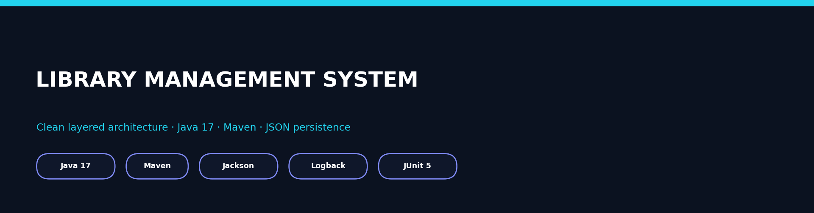
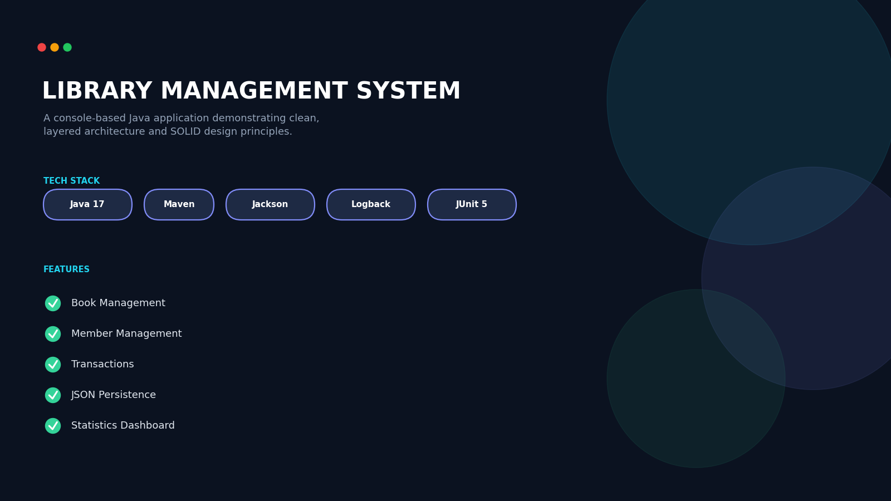
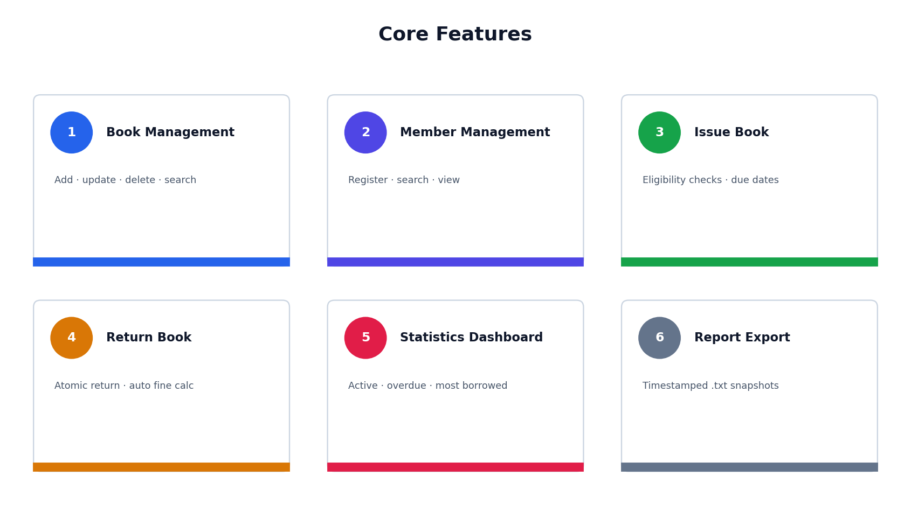
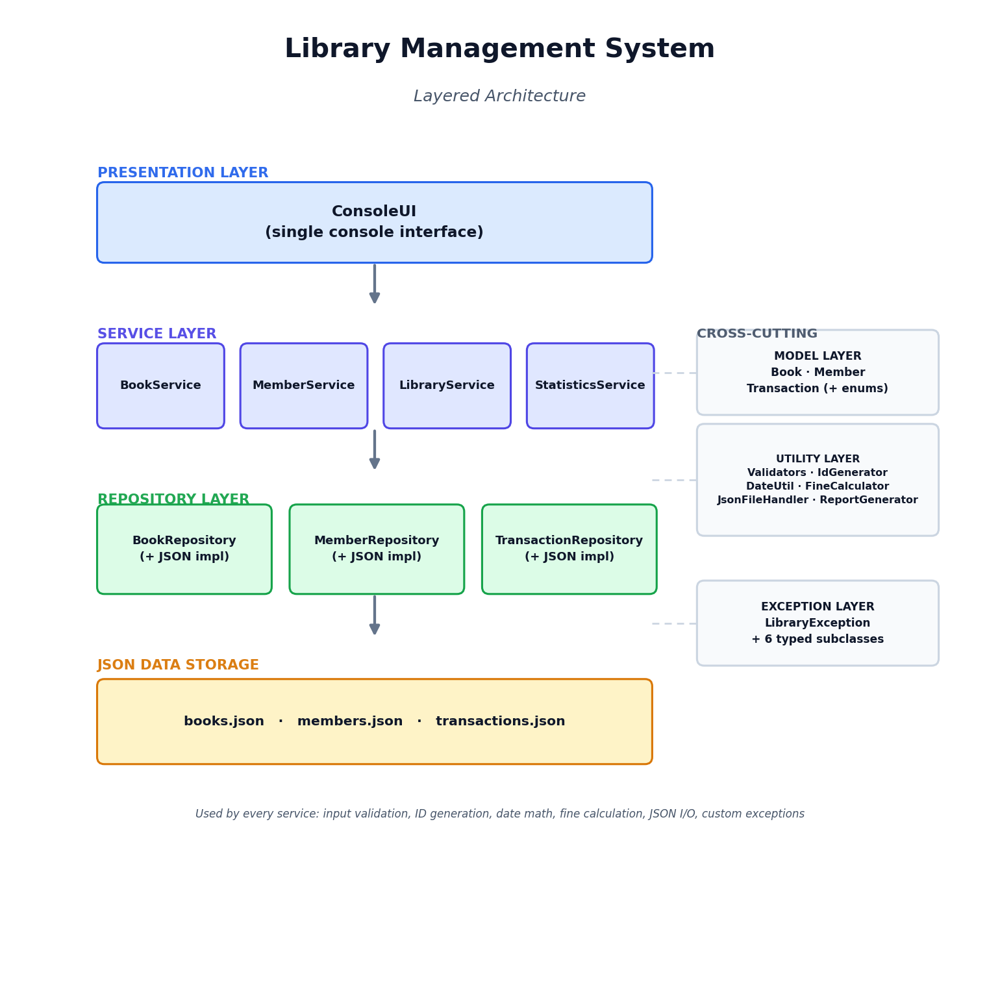
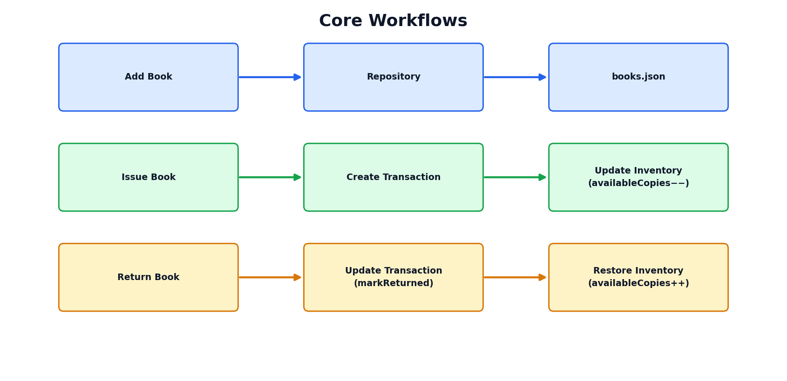
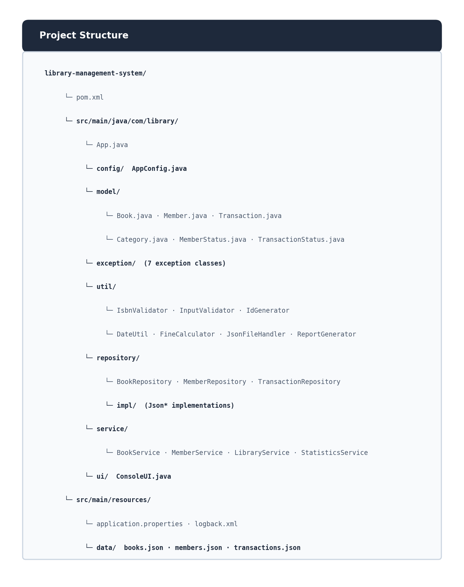
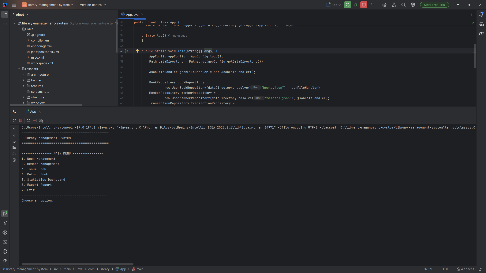
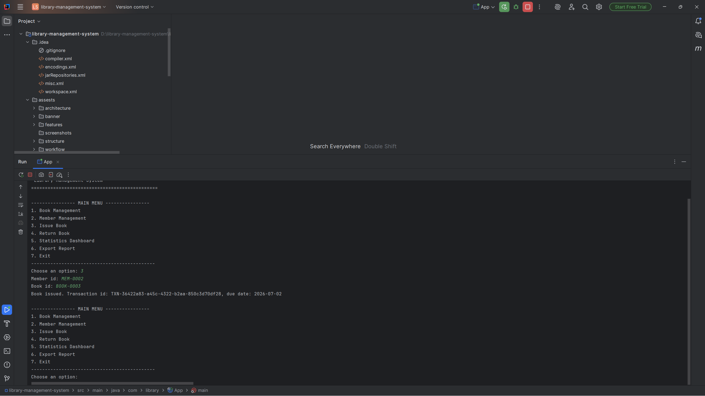
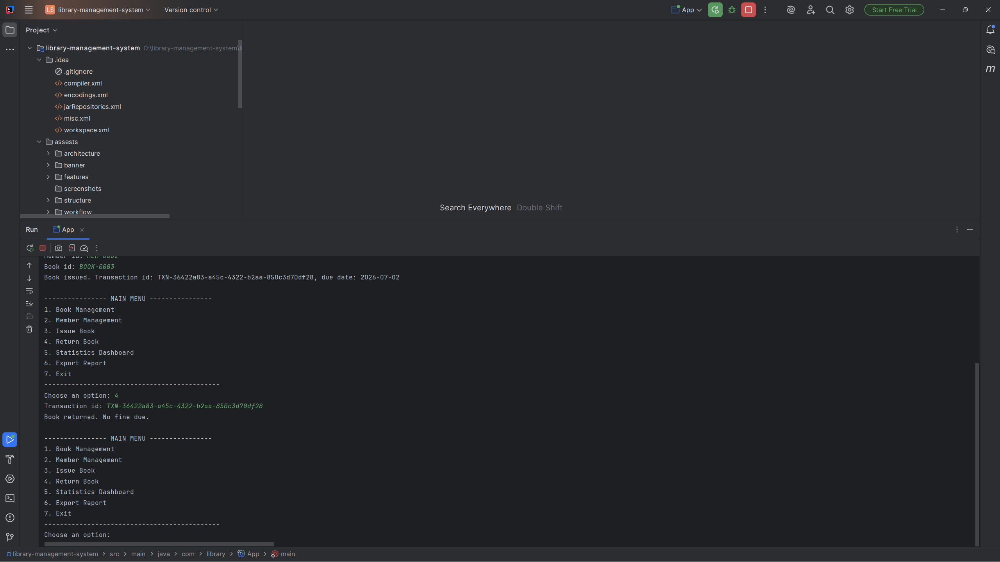
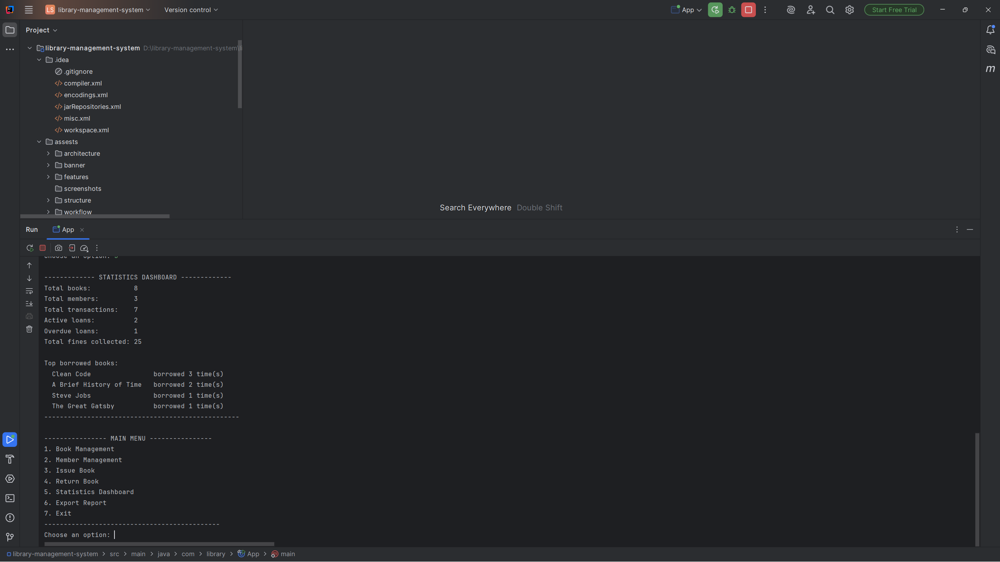

<div align="center">



# Library Management System

**Console-based Java app showcasing clean layered architecture, the repository pattern, and JSON persistence.**

[](https://openjdk.org/)
[](https://maven.apache.org/)
[](https://github.com/FasterXML/jackson)
[](https://logback.qos.ch/)
[](https://junit.org/junit5/)

</div>

---

## Project Preview

<div align="center">

</div>

A layered Java console application built around clear separation of concerns: business logic lives entirely in the service layer, persistence is abstracted behind repository interfaces, data is stored as JSON with atomic, crash-safe writes, and every failure path raises a typed, predictable exception instead of a generic error.

---

## Project Stats

| Metric | Details |
|---|---|
| Java Classes | 33+ |
| Architecture Layers | 6 |
| Custom Exceptions | 7 |
| Service Classes | 4 |
| Build System | Maven |
| Persistence | JSON (Jackson) |

---

## What This Project Demonstrates

- Strict layered architecture — dependencies only ever flow downward
- Repository pattern — swap JSON for a database with **zero** service-layer changes
- Atomic, crash-safe JSON writes (temp file → rename, never partial writes)
- Centralized validation + a typed, unchecked exception hierarchy
- Real ISBN-10/13 **checksum** validation, not just format matching
- Business rules (loan period, fine rate) externalized to a properties file

---

## Quick Features

<div align="center">

</div>

- ✅ **Book Management** — add, update, delete, search
- ✅ **Member Management** — register, search, track status
- ✅ **Issue Book** — eligibility checks + due-date calculation
- ✅ **Return Book** — atomic return with automatic fine calculation
- ✅ **Statistics Dashboard** — live active / overdue / most-borrowed metrics
- ✅ **Report Export** — timestamped `.txt` snapshots

---

## Architecture

<div align="center">

</div>

`ConsoleUI` → Services → Repositories → JSON Storage — one-directional, interface-bound dependencies. Model, Utility, and Exception layers cut across all three.

---

## Core Workflows

<div align="center">

</div>

### Add-Book Flow
Book Input → Validation → Repository → `books.json`

### Issue-Book Flow
Member Validation → Transaction Creation → Inventory Update

### Return-Book Flow
Transaction Update → Fine Calculation → Inventory Restore

---

## Project Structure

<div align="center">

</div>

Code is organized strictly by responsibility — model, exception, utility, repository, service, and UI each live in their own package. This separation of concerns keeps the layered architecture enforceable in practice, makes the codebase easy to navigate and maintain, and leaves a clear path to scale — such as swapping JSON for a database — without restructuring existing layers.

---

## Screenshots

| Main Menu | Issue Book |
|---|---|
|  |  |

| Return Book | Statistics Dashboard |
|---|---|
|  |  |

---

## Installation

**Prerequisites:** Java 17+, Maven 3.8+

```bash
git clone https://github.com/PawanChoudhary0607/Library-management-system.git
cd library-management-system
mvn clean install
mvn exec:java
```

Seed data is included — runs immediately after cloning.

---

## Recruiter Highlights

- Clean Architecture — strict separation between presentation, business logic, and persistence
- Repository Pattern — storage swappable without touching service or UI code
- OOP Principles — encapsulated entities with controlled state transitions
- SOLID Design — dependency inversion enforced at every repository boundary
- JSON Persistence — Jackson-based, atomic, crash-safe writes
- Exception Handling — typed, unchecked hierarchy with consistent error messages
- Maven Project Structure — standard layout, ready for build, test, and packaging

---

## Future Improvements

- Database integration (PostgreSQL / SQLite)
- Spring Boot migration
- REST API development
- Authentication & authorization
- Web dashboard
- Cloud deployment

---

<div align="center">

**Pawan Choudhary** · B.Tech CSE (AI/ML)
[GitHub](https://github.com/PawanChoudhary0607)

</div>
